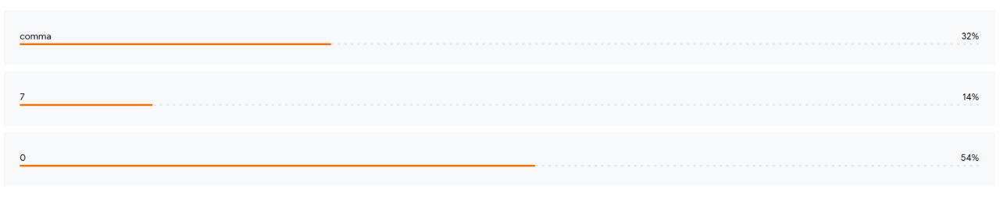
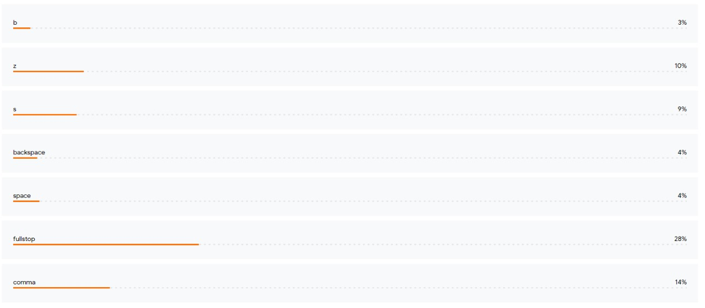
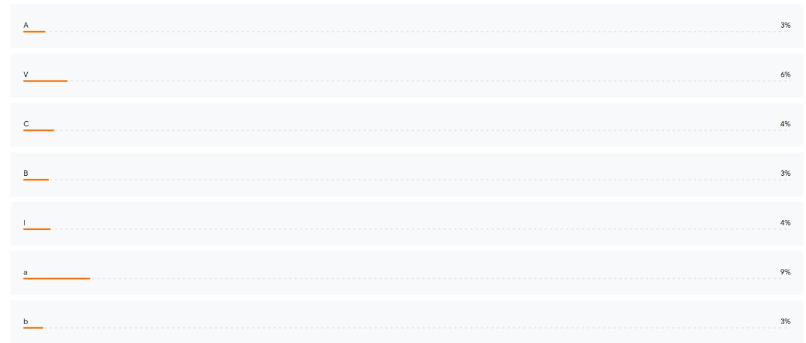

# GC_24_H2T_38

## Hardware configuration and component description

### Components Used:

1. **Nano 33 BLE Sense**: This microcontroller board is equipped with all the necessary sensors for the project.

2. **Lithium Polymer Battery (33.33Wh)**: Chosen due to its compatibility with the 3.3V logic level operation of the microcontroller. The battery provides ample power for extended operation.

3. **TP4056 LIPO Charge/Protect Module**: Ensures safe charging and protects the lithium polymer battery from overcharging, over-discharging, and short circuits.

4. **DC-DC Buck Converter**: Used to step down the nominal voltage of the lithium polymer battery (3.7V) to match the 3.3V logic level required by the microcontroller board.

### Hardware Configuration:

- The Nano 33 BLE Sense board is selected for its integrated sensors, reducing the need for external components and simplifying the hardware setup.

- The chosen lithium polymer battery provides sufficient energy capacity for prolonged usage of the project.

- The TP4056 LIPO charge/protect module ensures the safe and efficient charging of the battery, extending its lifespan.

- The DC-DC buck converter facilitates seamless integration of the lithium polymer battery with the 3.3V logic level operation of the microcontroller board, optimizing power efficiency.

### Data Collection,Training and Testing

- We have installed the latest arduino sketch on to your board.
- We have installed Arduino Nano 33 BLE driver on your arduino IDE.
- After the installation of the latest arduino sketch onto the board we have connected the board via bluetooth on the tiny motion tracker website.
- We have adjusted our capture settings by making the capturing threshold to be **x** and number of samples to be **y**
- Then we have created labels  [a-z], [A-Z], [0-9], forward space, backward space etc and recorded 20-30 samples of each.
- We have then trained our model and adjusted the samples and capturing parameters to minimise the loss and maximise the accuracy.
- Once training is done we have tested the model and after getting satisfactory results we have downloaded the arduino model and examples as quantize for memory efficiency.
- After unzipping the file we have an example code on our arduino IDE and also the list of samples as a header file.
- Now we have modified the code accordingly and using the serial monitor we have observed the tested results.

### ML model details
- Not just in the tiny motion tracker but we have also tried to make our own ML model.
- We have used an hybrid deep learning model using CNN and LSTM

### Performance Evaluation and metrics
#### The model performace on Tiny Motion Tracker is:
- Accuracy:
#### The model performance on the hybrid model:
- Accuracy:
   
## Some of the references of our model testing and training are as follows:

    
    
    

    <!-- Video 1 -->
    <video width="500" controls>
        <source src="video1.MP4" type="video/mp4">
        Your browser does not support the video tag.
    </video>
    <video width="500" controls>
        <source src="video2.MP4" type="video/mp4">
        Your browser does not support the video tag.
    </video>
    <video width="500" controls>
        <source src="video3.MP4" type="video/mp4">
        Your browser does not support the video tag.
    </video>
    <video width="500" controls>
        <source src="video4.MP4" type="video/mp4">
        Your browser does not support the video tag.
    </video>
    <video width="500" controls>
        <source src="video5.MP4" type="video/mp4">
        Your browser does not support the video tag.
    </video>

    

